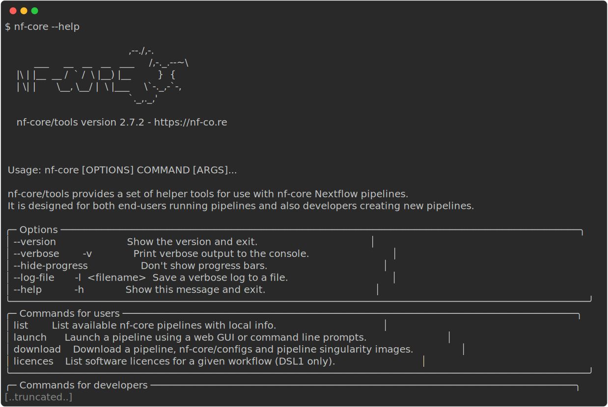

# 1.1 Introduction to nf-core and Nextflow

!!! tip ":construction: Objectives (WIP) :construction:"

    - Learn about nf-core and its core features.
    - Learn how to use nf-core tooling.
    - Use Nextflow to pull the `nf-core/rnaseq` workflow
    - Learn about the core features of Nextflow.
    - Learn Nextflow terminology.
    - Learn fundamental commands and options for executing workflows.

## 1.1.1 What is nf-core?

{width=100%}

nf-core is a **community** effort to collect a curated set of **analysis workflows** built using the workflow language **Nextflow**.

nf-core provides a standardized set of **best practices**, **guidelines**, and **templates** for building and sharing bioinformatics workflows. These workflows are designed to be **modular**, **scalable**, and **portable**, allowing researchers to easily adapt and execute them using their own data and compute resources.

The community is a diverse group of bioinformaticians, developers, and researchers from around the world who collaborate on **developing** and **maintaining** a growing collection of high-quality workflows. These workflows cover a range of applications, including transcriptomics, proteomics, and metagenomics.

One of the key benefits of nf-core is that it promotes **open development**, **testing**, and **peer review**, ensuring that the workflows are robust, well-documented, and validated against real-world datasets. This helps to increase the reliability and reproducibility of bioinformatics analyses and ultimately enables researchers to accelerate their scientific discoveries.

nf-core is published in Nature Biotechnology: [Nat Biotechnol 38, 276–278 (2020). Nature Biotechnology](https://www.nature.com/articles/s41587-020-0439-x)

**Key Features of nf-core workflows**

- **Documentation**
    - nf-core workflows have extensive documentation covering installation, usage, and description of output files to ensure that you won't be left in the dark.
- **CI Testing**
    - Every time a change is made to the workflow code, nf-core workflows use continuous-integration testing to ensure that nothing has broken.
- **Stable Releases**
    - nf-core workflows use GitHub releases to tag stable versions of the code and software, making workflow runs totally reproducible.
- **Packaged software**
    - Pipeline dependencies are automatically downloaded and handled using Docker, Singularity, Conda, or other software management tools. There is no need for any software installations.
- **Portable and reproducible**
    - nf-core workflows follow best practices to ensure maximum portability and reproducibility. The large community makes the workflows exceptionally well-tested and easy to execute.
- **Cloud-ready**
    - nf-core workflows are tested on AWS after every major release. You can even browse results live on the website and use outputs for your own benchmarking.

It is important to remember all nf-core workflows are **open-source** and **community driven**. Most pipelines are under active community development and are regularly updated with fixes and other improvements. Even though the pipelines and tools undergo repeated community review and testing - it is important to check your results.

## 1.1.2 What is Nextflow?

{width=100%}

Nextflow is the technology that underlies all nf-core pipelines. It is designed around the idea that the Linux platform is the lingua franca of data science. Linux provides many simple but powerful command-line and scripting tools that, when chained together, facilitate complex data manipulations. Nextflow extends this approach, adding the ability to define complex program interactions and a high-level parallel computational environment based on the dataflow programming model.

**Nextflow’s core features are:**

- Workflow portability and reproducibility
    - Workflow logic is separated from configuration, allowing workflows to be "written once and run anywhere" - from local machines to high performance computing (HPC) clusters and the cloud.
- Scalability through parallelisation
    - Workflows define **processes** (individual computational tasks to run) and **channels** that define how data flows between them; this model natively takes advantage of parallelisation as datasets grow in size, allowing the same workflow code to efficiently process small and large datasets equally.
- Flexible configuration
    - Nextflow supports defining configuration profiles and additional configuration files to override default settings and fine-tune processes for specific environments and datasets.
- Integration of existing tools, systems, and industry standards.


Because of these features, Nextflow has become one of the most prevalent workflow tools in the bioinformatics community, and this is why nf-core was built around Nextflow.

In today's workshop, we will be focusing on the configurability of nf-core pipelines, and so won't be further exploring the inner workings of Nextflow. If you would like more information about how Nextflow works and how to write your own pipelines, you can see our [Nextflow for Life Sciences training material](https://sydney-informatics-hub.github.io/hello-nextflow-2025/), as well as the [Nextflow documentation website](https://nextflow.io/docs/latest/).

!!! abstract ":construction: Poll (WIP) :construction:"

    1. What platform do you run your bioinformatics workflows on?
    2. What language to you prefer to write your scripts in?

## 1.1.3 Nextflow options and commands

Nextflow provides a robust command line interface for the management and execution of workflows. The top-level interface consists of options and commands.

!!! note "Nextflow is pre-installed for this workshop"

    For this workshop, we have pre-installed Nextflow so you don't need to worry about installing it and can get stuck right into using it.

    For future reference, we have some instructions for installing Nextflow in our [Tips and Tricks page](../tips_tricks.md#installing-nextflow).

You can list Nextflow options and commands with the `-h` option:

```default
nextflow -h
```


Options for a command can also be viewed by appending the `-help` option to that command.

For example, options for the the `run` command can be viewed:

```default
nextflow run -help
```


!!! example "Exercise"

    Find out which version of Nextflow you are using with the version option.

    ??? success "Solution"

        The version of Nextflow you are using can be printed using the `-v` option:

        ```default
        nextflow -version
        ```

        Or:

        ```default
        nextflow -v
        ```

## 1.1.4 Managing your environment

You can use [environment variables](https://www.nextflow.io/docs/latest/config.html#environment-variables) to control some low-level aspects of how Nextflow runs. For most users, Nextflow will work without setting any environment variables. However, to improve reproducibility and to optimise your resources, you may benefit from establishing environmental variables, which can be exported before running a workflow and will be interpreted by Nextflow. 

For example, for consistency, it is good practice to pin the version of Nextflow you are using with the `NXF_VER` variable:

```default
export NXF_VER=<version number>
```

!!! example "Exercise"

    Pin the version of Nextflow to `23.04.1` using the `NXF_VER` environmental variable and check that it has been applied.

    ??? success "Solution"

        Export the version using the `NXF_VER` environmental variable:

        ```default
        export NXF_VER=23.04.1
        ```

        Check that the new version has been applied using the `-v` option:

        ```default
        nextflow -v
        ```

Similarly, when running Nextflow using containers (as is best practice, especially on shared infrastructure like high performance computing (HPC) clusters), it is a good idea to set the paths to where container images are stored and can be accessed using the `NXF_*_CACHEDIR` variables, e.g. `NXF_SINGULARITY_CACHEDIR` for singularity images:

```default
export NXF_SINGULARITY_CACHEDIR=<custom/path/to/singularity/cache>
```

!!! example "Exercise"

    Create a new folder with the path `/home/training/singularity_cache` to store your singularity images and export its location using the `NXF_SINGULARITY_CACHEDIR` environmental variable:

    ??? success "Solution"

        Make a new folder for your Singularity images:

        ```default
        mkdir /home/training/singularity_cache
        ```

        Export your new folder as your cache directory for singularity images using the `NXF_SINGULARITY_CACHEDIR` environmental variable:

        ```default
        export NXF_SINGULARITY_CACHEDIR=/home/training/singularity_cache
        ```

        Singularity images downloaded by workflow executions will now be stored in this directory.

You may want to include these, or other environmental variables, in your `.bashrc` file (or alternate) that is loaded when you log in so you don’t need to export variables every session.

A complete list of environmental variables can be found [here](https://www.nextflow.io/docs/latest/reference/env-vars.html).

## 1.1.5 nf-core workflow structure

nf-core workflows follow a set of best practices and standardized conventions. nf-core workflows start from a **common template** and follow the same structure. Although you won’t need to edit code in the workflow project directory, having a basic understanding of the project structure and some core terminology will help you understand how to configure its execution.

{width=50%}

Most nf-core workflows consist of a single **workflow** file (there are a few exceptions). This is the main `<workflow>.nf` file that is used to bring everything else together. Instead of having one large monolithic script, it is broken up into a combination of **subworkflows** and **modules** that are stored as separate `.nf` files.


A **subworkflow** is a group of modules that are used in combination with each other and have a common purpose. For example, the [`SAMTOOLS_STATS`](https://github.com/nf-core/modules/blob/master/modules/nf-core/samtools/stats/main.nf), [`SAMTOOLS_IDXSTATS`](https://github.com/nf-core/modules/blob/master/modules/nf-core/samtools/faidx/main.nf), and [`SAMTOOLS_FLAGSTAT`](https://github.com/nf-core/modules/blob/master/modules/nf-core/samtools/flagstat/main.nf) modules are all included in the [`BAM_STATS_SAMTOOLS`](https://github.com/nf-core/modules/blob/master/subworkflows/nf-core/bam_stats_samtools/main.nf) subworkflow. Subworkflows improve workflow readability and help with the reuse of modules within a workflow. Within an nf-core workflow, you will find a mix of both **nf-core subworkflows** that were developed by the community and shared in the [nf-core subworkflows GitHub repository](https://github.com/nf-core/modules/tree/master/subworkflows/nf-core), and **local subworkflows** that are specific to just that one pipeline.

A **module** is a wrapper for a process, the basic processing primitive to execute a user script. It can specify [directives](https://www.nextflow.io/docs/latest/process.html#directives), [inputs](https://www.nextflow.io/docs/latest/process.html#inputs), [outputs](https://www.nextflow.io/docs/latest/process.html#outputs), and a [script](https://www.nextflow.io/docs/latest/process.html#script) block. Most modules will execute a single tool in the script block and will make use of the directives, inputs, and outputs dynamically. Like subworkflows, modules can also be developed and shared in the [nf-core modules GitHub repository](https://github.com/nf-core/modules/tree/master/modules/nf-core) or stored as a local module. All modules from the nf-core repository are version controlled and tested to ensure reproducibility.

## 1.1.6 nf-core tools

nf-core have created a set of helper tools for use with Nextflow workflows. These tools have been developed to provide a range of additional functionality for **using**, **developing**, and **testing** workflows.

!!! note "nf-core tools is pre-installed for this workshop"

    As with Nextflow, we have pre-installed nf-core tools so you don't need to installing it yourself.

    For your reference, see the [Tips and Tricks page](../tips_tricks.md#installing-nf-core-tools) for information on installing nf-core tools on your onw systems.

The nf-core `--version` option can be used to print your version of nf-core tools:

```default
nf-core --version
```

nf-core tools are for everyone and has commands to help both **users** and **developers**. For users, the tools make it easier to execute workflows. For developers, the tools make it easier to develop and test your workflows using best practices. You can read about the nf-core commands on the [tools page](https://nf-co.re/tools/) of the nf-core website or using the command line.

!!! question "Exercise"

    Find out what nf-core tools commands and options are available using the `--help` option:

    ??? success "Solution"

        Execute the `--help` option to list the options, commands for users, and commands for developers:

        ```default
        nf-core --help
        ```

        

nf-core tools is updated with new features and fixes regularly so it's best to keep your version of nf-core tools up-to-date.

## 1.1.7 Executing a workflow

Nextflow seamlessly integrates with code repositories such as [GitHub](https://github.com/). This feature allows you to manage your project code and use public Nextflow workflows &mdash; including nf-core workflows &mdash; quickly, consistently, and transparently.

The Nextflow `pull` command will download a workflow from a hosting platform into your global cache `$HOME/.nextflow/assets` folder.

If you are pulling a project hosted in a remote code repository, you can specify its qualified name or the repository URL. The qualified name is formed by two parts - the owner name and the repository name separated by a `/` character. For example, if a Nextflow project `bar` is hosted in a GitHub repository `foo` at the address `http://github.com/foo/bar`, it could be pulled using:

```default
nextflow pull foo/bar
```

Or by using the complete URL:

```default
nextflow pull http://github.com/foo/bar
```

Alternatively, the Nextflow `clone` command can be used to download a workflow into the current directory:

```default
nextflow clone foo/bar
```

This is equivalent to pulling the GitHub repository directly with `git clone https://github.com/foo/bar`. The `nextflow clone` syntax simply shortens and cleans up the command.

The Nextflow `run` command is used to initiate the execution of a workflow:

```default
nextflow run foo/bar
```

If you `run` a workflow, it will look for a local file with the workflow name you’ve specified. If that file does not exist, it will look for a public repository with the same name on GitHub (unless otherwise specified). If it is found, Nextflow will automatically `pull` the workflow to your global cache and execute it.

!!! warning "Warning"

    Be aware of what is already in your current working directory where you launch your workflow, if there are other workflows (or configuration files) you may encounter unexpected results.

!!! example "Exercise"

    Execute the `hello` workflow directly from `nextflow-io` [GitHub](https://github.com/nextflow-io/hello) repository.

    ??? success "Solution"

        Use the `run` command to execute the [nextflow-io/hello](https://github.com/nextflow-io/hello) workflow:

        ```default
        nextflow run nextflow-io/hello
        ```

        

More information about the Nextflow `run`, `pull`, and `clone` commands can be found in the Nextflow documentation:

- [run](https://www.nextflow.io/docs/latest/reference/cli.html#run)
- [pull](https://www.nextflow.io/docs/latest/reference/cli.html#pull)
- [clone](https://www.nextflow.io/docs/latest/reference/cli.html#clone)

!!! tip "Executing a revision"

    For each of the commands `run`, `pull`, and `clone`, you can optionally supply the option `-r <REVISION>` to pull a specific version of the workflow. This can be any valid branch or tag name, e.g.:

    ```bash
    nextflow run -r dev foo/bar
    ```

    or

    ```bash
    nextflow run -r 1.2.0 foo/bar
    ```

!!! note "Our recommendation"

    As you can see, there are a few different ways you can go about running a nextflow or nf-core pipeline. We recommend using either the `nextflow clone` command or directly cloning the repository with `git clone`. This is because it is the most flexible approach and gives you control over exacly where the workflow is being cloned to (instead of all pipelines going to `$HOME/.nextflow/assets` as with `nextflow pull`/`nextflow run`).

## 1.1.8 Nextflow log

It is important to keep a record of the commands you have run to generate your results. Nextflow helps with this by creating and storing metadata and logs about the run in hidden files and folders in your current directory (unless otherwise specified). This data can be used by Nextflow to generate reports. It can also be queried using the Nextflow `log` command:

```default
nextflow log
```

The `log` command has multiple options to facilitate the queries and is especially useful while debugging a workflow and inspecting execution metadata. You can view all of the possible `log` options with `-h` flag:

```default
nextflow log -h
```

To query a specific execution you can use the `RUN NAME` or a `SESSION ID`:

```default
nextflow log <run name>
```

To get more information, you can use the `-f` option with named fields. For example:

```default
nextflow log <run name> -f process,hash,duration
```

There are many other fields you can query. You can view a full list of fields with the `-l` option:

```default
nextflow log -l
```

!!! example "Exercise"

    Use the `log` command to view with `process`, `hash`, and `script` fields for your tasks from your most recent Nextflow execution.

    ??? success "Solution"

        Use the `log` command to get a list of you recent executions:

        ```default
        nextflow log
        ```

        

        Query the process, hash, and script using the `-f` option for the most recent run:

        ```default
        nextflow log crazy_faggin -f process,hash,script
        ```

        

## 1.1.9 Execution cache and resume

When running large (and possibly expensive) workflows, we want to be sure that if we need to re-run the workflow (e.g. a job failed due to low memory or maybe we changed a parameter or added a new sample) that the workflow won't have to start again from the very beginning. Instead, we want to re-use any previously generated outputs that are still valid and aren't affected by any changes we've made to the run. Task execution **caching** achieves this by keeping track of previous runs and their outputs and re-using them where possible.

In Nextflow, we can utilise this cache by using the `-resume` option. The cache works keeping track of the file paths, file sizes, and modification times of all input files to a process. It also keeps track of the process definition itself. If these are unchanged between runs, the **cached** outputs are re-used. If any of these values have changed, the process will be re-run.

!!! note "Key points"

    - nf-core is a community effort to collect a curated set of analysis workflows built using Nextflow.
    - Nextflow is a workflow management engine and coding language that makes it easy to write data-intensive computational workflows.
    - Environment variables can be used to control your Nextflow runtime.
    - Nextflow has automatic integrations with online code repositories and supports version control.
    - Nextflow will cache your runs and they can be resumed with the `-resume` option.
    - You can manage workflows with various Nextflow commands (e.g., `pull`, `clone`, `run`, and `log`).
