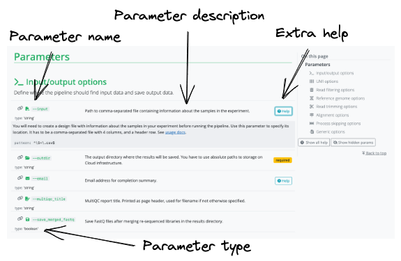

# 1.3 Configuring nf-core workflows

!!! tip "Objectives"

    - Learn how to customize the execution of an nf-core workflow
    - Customize a toy example of an nf-core workflow

## 1.3.1 Introduction to Nextflow configuration

There are two ways in which we can control how nf-core and other Nextflow pipelines run: through Nextflow **configuration files** and through **pipeline parameters**. Configuration files are special `.config` files which are used to set a wide variety of options that control how the Nextflow engine runs, such as defining computing environments, specifying containerisation systems, and setting resources required by processes. Pipeline parameters, on the other hand, are specific to the pipeline you are running and are used to pass information to the pipeline such as sample information, filtering thresholds, reference files, etc.

## 1.3.2 Nextflow configuration files

When a workflow is launched, Nextflow will look for configuration files in several locations. As each configuration file can contain conflicting settings, the sources are ranked to decide which settings to apply. Configuration sources are reported below and listed in order of increasing priority:

1. `$NXF_HOME/config` (defaults to `$HOME/.nextflow/config`)
2. `nextflow.config` in the project directory
3. `nextflow.config` in the launch directory
4. Config files specified with `-c <config-files>`

All nf-core pipelines come with a `nextflow.config` file in their project directory which contains the default configuration options for the pipeline. The other files listed above are all instances of **custom configuration files** that can be supplied by the user to override the pipeline defaults. Understanding how and when these files are interpreted by Nextflow is critical for the accurate configuration of a workflows execution.

!!! tip "Project and launch directories"

    Note how Nextflow looks for two different files, each called `nextflow.config`, first in the project directory, then in the launch directory. There is a subtle but important difference between these two directories. The **project** directory is the folder containing the pipeline code, i.e. what you download when running `nextflow clone` or `nf-core pipelines download`. The **launch** directory is your current working directory in which you run `nextflow run`.

    For example, in [Lesson 1.2.4](./1.2_run.md#124-downloading-and-executing-workflows-with-nextflow) when we downloaded and ran `nextflow-io/hello`, our launch directory was `~/session1`, while the project directory was `~/session1/hello`. Were we to create the file `~/session1/nextflow.config` and set configuration options inside it, those options would take precedence over any conflicting settings defined in `~/session1/hello/nextflow.config`.

This system allows you to finely tune how Nextflow runs for you. An nf-core workflow will come with its own `nextflow.config` file, but you can use your own `nextflow.config` file in your launch directory to override the defaults. You may also have a config file at `$HOME/.nextflow/config` to set configuration options that you frequently use across different pipelines.

!!! warning "Caveat"

    While there is a lot of flexibility built in to this configuration system, it can also cause subtle problems. Both the **launch directory** `nextflow.config` file and the `$NXF_HOME/config` files are loaded **implicitly**, meaning you don't need to tell Nextflow to load them. This can be convenient, but if you forget these files exist when running a new pipeline, you may find that Nextflow behaves unexpectedly!

    In general, we recommend that all custom configuration options be passed to Nextflow **explicitly** using the `-c` option.

Notably, configuration files typically define of one or more **profiles**. A profile is a set of configuration attributes that are grouped together and can be activated when launching a workflow by using the `-profile` command option:

```bash
nextflow run <workflow> -profile <profile>
```

nf-core pipelines define several profiles, which primarily fall under one of two types:

- **Software management profiles**
    - Profiles for specifying the software management tool to use when running the pipeline, e.g., `docker`, `singularity`, and `conda`
- **Test profiles**
    - Profiles for executing the workflow with a standardized set of test data and parameters, e.g., `test` and `test_full`
    - Test profiles are typically used during development to check whether new changes work as expected; they are also a great place to start when learning how to use a new pipeline

Importantly, multiple profiles can be activated at the same time by specifying them in a comma-separated (`,`) list when you execute your command. The order of profiles is important as they will be read from left to right. If there is any overlap in the configuration options set by each profile, the right-most profile will take precedence.

```bash
nextflow run <workflow> -profile test,singularity
```

!!! example "Exercise 1.3.2.1 :stopwatch: 2 mins"

    We have created a small demo pipeline using the nf-core template called `nf-core-demo`. It's located in a repository on the `Sydney-Informatics-Hub` GitHub organisation. Over the next several exercises, we're going to use it to see how we can configure how an nf-core pipeline runs.
    
    Start by using `nextflow clone` to download the pipeline repository to your working directory.

    ```bash
    nextflow clone Sydney-Informatics-Hub/nf-core-demo
    ```

    You should get the following message:

    ```console title="Output"
    Sydney-Informatics-Hub/nf-core-demo cloned to: nf-core-demo
    ```

    If you list the repository contents, you should see the typical directory structure of an nf-core pipeline:

    ```bash
    ls nf-core-demo
    ```

    ```console title="Output"
    assets               conf                 modules              README.md
    bin                  docs                 modules.json         subworkflows
    CHANGELOG.md         lib                  nextflow_schema.json workflows
    CITATIONS.md         LICENSE              nextflow.config
    CODE_OF_CONDUCT.md   main.nf              pyproject.toml
    ```

!!! warning "Check your Singularity cache dir is set"

    For the remainder of the workshop, we are using **Singularity containers** to manage software installation. This means the tools we use don't need to be installed directly on the machines and we can control exactly which version of each tool we use. For this to work properly, we need to ensure that the `NXF_SINGULARITY_CACHEDIR` environment variable is set.
    
    Recall in the [previous lesson](./1.2_run.md#122-managing-your-environment) we set this variable in our `~/.bashrc` file. Confirm the variable is still set:
    
    ```bash
    echo $NXF_SINGULARITY_CACHEDIR
    ```

    You should see the path we chose printed to the terminal:

    ```console title="Output"
    /home/training/singularity_cache
    ```

!!! example "Exercise 1.3.2.2 :stopwatch: 3 mins"

    Now that you have cloned the `Sydney-Informatics-Hub/nf-core-demo` pipeline, run it. Use the `test` profile to automatically provide a test dataset as input. Additionally, use the `singularity` profile to tell Nextflow to use Singularity containers to run each of the workflow modules:

    ```bash
    nextflow run nf-core-demo -profile test,singularity
    ```

    ```console title="Output"

    N E X T F L O W   ~  version 25.10.4

    Launching `nf-core-demo/main.nf` [sleepy_mendel] DSL2 - revision: 282d7ef11e

    ------------------------------------------------------
                                            ,--./,-.
            ___     __   __   __   ___     /,-._.--~'
        |\ | |__  __ /  ` /  \ |__) |__         }  {
        | \| |       \__, \__/ |  \ |___     \`-._,-`-,
                                            `._,._,'
        nf-core/demo v1.0dev
    ------------------------------------------------------
    Core Nextflow options
        runName                   : sleepy_mendel
        containerEngine           : singularity
        launchDir                 : /Users/training/Downloads/test
        workDir                   : /Users/training/Downloads/test/work
        projectDir                : /Users/training/Downloads/test/nf-core-demo
        userName                  : training
        profile                   : test,singularity
        configFiles               : /Users/training/Downloads/test/nf-core-demo/nextflow.config

    Input/output options
        input                     : https://raw.githubusercontent.com/nf-core/test-datasets/viralrecon/samplesheet/samplesheet_test_illumina_amplicon.csv
        outdir                    : my_results

    Reference genome options
        genome                    : R64-1-1
        fasta                     : s3://ngi-igenomes/igenomes/Saccharomyces_cerevisiae/Ensembl/R64-1-1/Sequence/WholeGenomeFasta/genome.fa

    Institutional config options
        config_profile_name       : Test profile
        config_profile_description: Minimal test dataset to check pipeline function

    Max job request options
        max_cpus                  : 2
        max_memory                : 6.GB
        max_time                  : 6.h

    !! Only displaying parameters that differ from the pipeline defaults !!
    ------------------------------------------------------
    If you use nf-core/demo for your analysis please cite:

    * The nf-core framework
        https://doi.org/10.1038/s41587-020-0439-x

    * Software dependencies
        https://github.com/nf-core/demo/blob/master/CITATIONS.md
    ------------------------------------------------------
    executor >  local (6)
    [6e/df7039] process > NFCORE_DEMO:DEMO:INPUT_CHECK:SAMPLESHEET_CHECK (samplesheet_test_illumina_amplicon.csv) [100%] 1 of 1 ✔
    [a6/cc842c] process > NFCORE_DEMO:DEMO:FASTQC (SAMPLE2_PE_T1)                                                 [100%] 4 of 4 ✔
    [97/61b9c7] process > NFCORE_DEMO:DEMO:MULTIQC                                                                [100%] 1 of 1 ✔
    -[nf-core/demo] Pipeline completed successfully-

    ```

### 1.3.3 Default nf-core configuration files

All of an nf-core pipeline's default parameters, configuration options, and profiles, are either defined in the pipeline's `nextflow.config` file, or are **imported** into that file from one of the `.config` files stored in the `conf/` directory. The use of multiple `.config` files helps to logically separate different configuration options, such as the default and test configurations. Some of these `.config` files are included by default, while others can be optionally activated via profiles. The most important of these are:

- `base.config`
    - Included by the workflow by default
    - Generous resource allocations using labels
    - Does not specify any method for software management and expects software to be available (or specified elsewhere)
- `modules.config`
    - Included by the workflow by default
    - Module-specific configuration options (both mandatory and optional)
    - **Note:** This file isn't 100% consistent between pipelines. Some pipelines (e.g. [`nf-core/sarek`](https://nf-co.re/sarek)) have a `conf/modules/` folder with per-module `.config` files inside.
- `test.config`
    - Only included if specified as a profile (`-profile test`)
    - A configuration profile to test the workflow with a small test dataset
- `test_full.config`
    - Only included if specified as a profile (`-profile test_full`)
    - A configuration profile to test the workflow with a full-size test dataset

nf-core workflows are also required to define **software containers** and **conda environments** that can be activated using profiles. Although it may be *technically possible* to run the workflows with software installed by other methods (e.g., environment modules or manual installation), this is highly discouraged, since these pipelines have been designed around and tested using containers/conda. Using containerisation systems like Docker or Singularity is also much more convenient and ensures reproducibility.

!!! tip

    If you're computer has internet access and one of Conda, Singularity, or Docker installed, you should be able to run any nf-core workflow with the `test` profile and the respective software management profile 'out of the box'. The `test` data profile will pull small test files directly from the `nf-core/test-data` GitHub repository and run it on your local system. The `test` profile is an important control to check the workflow is working as expected and is a great way to trial a workflow. Some workflows have multiple test profiles for you to trial.

!!! tip "Shared configuration files"

    An `includeConfig` statement in the `nextflow.config` file is also used to include custom institutional profiles that have been submitted to the nf-core [config repository](https://github.com/nf-core/configs). You can see a list of all current configs on the [nf-core website](https://nf-co.re/configs). At run time, nf-core workflows will fetch these configuration profiles from the nf-core config repository and make them available. They can be activated using the same `-profile` syntax discussed above.

    For shared resources such as an HPC cluster, you may consider developing your own shared institutional profile. You can follow [this tutorial](https://nf-co.re/docs/tutorials/use_nf-core_pipelines/writing_institutional_profiles) for more help.

## 1.3.4 Pipeline parameters

Every nf-core pipeline defines a set of parameters that can be used to pass data, filtering thresholds, options, and other information to the pipeline and influence how it runs. These parameters are defined and given sensible defaults in the main `nextflow.config` file in the pipeline repository. While these default values are chosen to be applicable to the average user, you will almost certainly want to modify some of these to fit your own purposes and datasets.

!!! warning "IMPORTANT!"

    nf-core pipeline **parameters** must be passed via the command line (`--<parameter>`) or Nextflow `-params-file` option. Custom config files, including those provided by the `-c` option, can be used to provide any configuration **except** for parameters.

    We discuss both of these methods for passing parameters further down.

To help with setting parameters, each nf-core pipeline has an associated **schema** which describes the full list of **parameters** it accepts. You can find this manifest on the pipeline's page on the nf-core website, which displays a description and value type of each parameter. Most parameters will have additional text to help you understand when and how a parameter should be used. For example, the following is from the [parameter page for `nf-core/rnaseq`](https://nf-co.re/rnaseq/3.23.0/parameters):

[{width=80%}](https://nf-co.re/rnaseq/3.23.0/parameters)

Parameters and their descriptions can also be viewed **in the command line** using the `run` command with the `--help` parameter:

```bash
nextflow run <workflow> --help
```

!!! example "Exercise 1.3.4 :stopwatch: 1 min"

    Use the `--help` parameter to view the available parameters for our `Sydney-Informatics-Hub/nf-core-demo` pipeline:

    ```bash
    nextflow run nf-core-demo --help
    ```

    You should see:

    ```console title="Output"

    N E X T F L O W   ~  version 25.10.4

    Launching `nf-core-demo/main.nf` [drunk_sammet] DSL2 - revision: 282d7ef11e


    ------------------------------------------------------
                                            ,--./,-.
            ___     __   __   __   ___     /,-._.--~'
        |\ | |__  __ /  ` /  \ |__) |__         }  {
        | \| |       \__, \__/ |  \ |___     \`-._,-`-,
                                            `._,._,'
        nf-core/demo v1.0dev
    ------------------------------------------------------
    Typical pipeline command:

        nextflow run nf-core/demo --input samplesheet.csv --genome GRCh37 -profile docker

    Input/output options
        --input                       [string]  Path to comma-separated file containing
                                                information about the samples in the experiment.
        --outdir                      [string]  The output directory where the results will be saved.
                                                You have to use absolute paths to storage on Cloud infrastructure.
        --email                       [string]  Email address for completion summary.
        --multiqc_title               [string]  MultiQC report title. Printed as page header,
                                                used for filename if not otherwise specified.

    Reference genome options
        --genome                      [string]  Name of iGenomes reference.
        --fasta                       [string]  Path to FASTA genome file.

    Generic options
        --multiqc_methods_description [string]  Custom MultiQC yaml file containing
                                                HTML including a methods description.

    FastQC options
        --kmer                        [integer] FastQC kmer length [default: 7]

    !! Hiding 24 params, use --show_hidden_params to show them !!
    ------------------------------------------------------
    If you use nf-core/demo for your analysis please cite:

    * The nf-core framework
        https://doi.org/10.1038/s41587-020-0439-x

    * Software dependencies
        https://github.com/nf-core/demo/blob/master/CITATIONS.md
    ------------------------------------------------------
    ```

## 1.3.5 Setting workflow parameters on the command line

One way of setting workflow parameters is directly via the command line. Any parameter can be configured on the command line by prefixing the parameter name with a double dash (`--`):

```bash
nextflow run <workflow> --<parameter>
```

Parameters set via the command line this way take the highest precedence and will override conflicting parameters defined anywhere else.

!!! tip

    Remember that workflow parameters are prefixed with a **double dash** (`--`), while options to the `nextflow run` command itself are prefixed with a single dash (`-`).

All parameters take **arguments**, i.e. a value that they get set to. Arguments are specified on the command line immediately after the parameter name:

```bash
nextflow run <workflow> --<parameter> <argument>
```

Note that string arguments must be wrapped in quotes if they contain spaces:

```bash
nextflow run <workflow> --<parameter> "A multi-word string"
```

Some parameters are **boolean**, i.e. they are set to either `true` or `false`. These are typically used to turn some pipeline functionality on or off. To set these, you simply write `true` or `false` after the parameter name:

```bash
nextflow run <workflow> --some_boolean_parameter true --some_other_boolean_parameter false
```

A special case is when you are setting a parameter to `true`. In this case, you can omit the word `true`:

```bash
nextflow run <workflow> --some_boolean_parameter

# Equivalent to:
nextflow run <workflow> --some_boolean_parameter true
```

!!! example "Exercise 1.3.5 :stopwatch: 3 mins"

    The `nf-core-demo` pipeline generates a MultiQC report. From the help information we printed out before, we can see that one of the pipeline parameters can be used to customise the title of this report. Run the `nf-core-demo` pipeline and use this parameter to customise the title of the MultiQC report with the name of your **favourite animal**.

    Add the `--multiqc_title` flag to your `nextflow run` command and provide it the name you chose. If you chose a name containing spaces, ensure you wrap the string in double quotes first. Don't forget to provide the `test` and `singularity` profiles as well! Additionally, use the `-resume` flag to avoid re-running the entire pipeline again.

    ```bash
    nextflow run nf-core-demo -profile test,singularity --multiqc_title koala -resume
    ```

    In this example, you can check your parameter has been applied by listing the files created in the results folder (`my_results`):

    ```bash
    ls my_results/multiqc/
    ```

    `--multiqc_title` is a parameter that directly impacts a result file. You should see something like the following:

    ```console title="Output"
    koala_multiqc_report_data  koala_multiqc_report_plots koala_multiqc_report.html
    ```

    For parameters that are not as obvious, you may need to check your `log` to ensure your changes have been applied. You **can not** rely on the changes to parameters printed to the command line when you execute your run:

    ```bash
    nextflow log $(nextflow log -q | tail -n 1) -f "process,script"
    ```

    ```console title="Output" hl_lines="6"
    ...

    NFCORE_DEMO:DEMO:MULTIQC	
        multiqc \
            --force \
            --title "koala" \
            --config multiqc_config.yml \
            \
            .

        cat <<-END_VERSIONS > versions.yml
        "NFCORE_DEMO:DEMO:MULTIQC":
            multiqc: $( multiqc --version | sed -e "s/multiqc, version //g" )
        END_VERSIONS

        ...
        ```

## 1.3.6 Using parameter files

Setting parameters via the command line might be ok for one or two parameters, but for a typical nf-core workflow you may need to set a lot of parameters to suit your use case. Using the command line to set lots of parameters like this can be error-prone and messy, so Nextflow offers another method: parameter files.

Parameter files are either JSON (`.json`) or YAML (`.yaml` or `.yml`) files that can contain an unlimited number of parameters as key-value pairs:

```json title="Custom parameters in JSON format"
{
   "parameter1_name": 1,
   "parameter2_name": "a string",
   "parameter3_name": true
}
```

```yaml title="The same custom parameters in YAML format"
parameter1_name: 1
parameter2_name: "a string"
parameter3_name: true
```

The above examples are equivalent to passing `--parameter1_name 1 --parameter2_name "a string" --parameter3_name true` on the command line.

You can override a workflow's default parameters by creating a custom parameter file like this and passing it as a command-line argument using the `-params-file` option.

```bash
nextflow run <workflow> -profile test,docker -params-file /path/to/custom_params.json
```

This keeps all of your parameters together in a separate file and keeps your `nextflow run` command nice and clean.

!!! example "Exercise 1.3.6.1 :stopwatch: 5 mins"

    Run the `nf-core-demo` pipeline again and use a custom **parameter file** to set the title of the MultiQC report to the name of your **favourite food**.

    Create a file called `my_custom_params.json` that contains your favourite food, e.g., cheese:

    ```json title="my_custom_params.json"
    {
        "multiqc_title": "cheese"
    }
    ```

    Include the custom `.json` file in your execution command with the `-params-file` option:

    ```bash
    nextflow run nf-core-demo -profile test,singularity -params-file my_custom_params.json -resume
    ```

    Check that it has been applied:

    ```bash
    ls my_results/multiqc/
    ```

    ```console title="Output"
    cheese_multiqc_report_data  cheese_multiqc_report_plots cheese_multiqc_report.html
    ```

Remember that the parameters specified on the command line, e.g. `--paremter_name`, will take precedence over any conflicting values specified in a parameter file with `-params-file`.

!!! example "Exercise 1.3.6.2 :stopwatch: 2 mins"

    Run the `nf-core-demo` pipeline again using the custom parameter file you made in Exercise 1.3.6.1. In addition, use the `--<parameter_name>` syntax to set the title of the MultiQC report to the name of your **favourite colour**.

    ??? success "Solution"

        Use the same command that you used in Exercise 1.3.6.1, but this time add `--multiqc_title` along with your favourite colour:

        ```bash
        nextflow run nf-core-demo -profile test,singularity -params-file my_custom_params.json --multiqc_title blue -resume
        ```

        Check the results to see which one was applied:

        ```bash
        ls my_results/multiqc
        ```

        ```console title="Output"
        blue_multiqc_report_data  blue_multiqc_report_plots blue_multiqc_report.html
        ```

        The value supplied to `--multiqc_title` on the command line (`blue`) took precedence over the value supplied in `my_custom_params.json` (`cheese`). Remember, parameters specified on the command line take precedence over parameters set in `-params-file` or `.config` files.

## 1.3.7 Custom configuration files

Nextflow can load additional, custom configuration options from any arbitrary `.config` file supplied to the `-c` option on the command line:

```bash
nextflow run <workflow> -profile test,docker -c /path/to/custom.config
```

This allows you to customise the configuration of the Nextflow run beyond the defaults and what is set by any institutional profile. Furthermore, multiple custom `.config` files can be included at execution by separating them with a comma (`,`). Note that the **order matters**, with the files being read in left to right, and the right-most files taking precedence.

Custom configuration files follow the same structure as the main `nextflow.config` file included in the workflow directory. Configuration properties are organized into [scopes](https://docs.seqera.io/nextflow/config#syntax) by dot-prefixing the property names with a scope identifier or grouping the properties in the same scope using the curly brackets notation. For example:

```groovy
process.cpus  = 1
process.memory  = '4 GB'
```

is equivalent to:

```groovy
process {
    cpus = 1
    memory = '4 GB'
}
```

Scopes allow you to quickly configure settings required to deploy a workflow on different infrastructure using different software management. For example, the `executor` scope can be used to provide settings for the deployment of a workflow on a HPC cluster. Similarly, the `singularity` scope controls how Singularity containers are executed by Nextflow. Multiple scopes can be included in the same `.config` file using a mix of dot prefixes and curly brackets. See the [Nextflow documentation](https://docs.seqera.io/nextflow/config) for more information on writing configuration files, as well as [this list of configuration options](https://docs.seqera.io/nextflow/reference/config).

!!! example "Exercise 1.3.7 :stopwatch: 3 mins"

    Run the `nf-core-demo` pipeline again and use a **custom config file** to set the title of the MultiQC report to the name of your **favourite month**.

    Create a file called `my_custom_config.config` and set the `multiqc_title` parameter within the `params` scope to your favourite month, e.g., October:

    ```groovy title="my_custom_config.config"
    params.multiqc_title = "October"
    ```

    Alternatively, use the longer scope block format:

    ```groovy title="my_custom_config.config"
    params {
        multiqc_title = "October"
    }
    ```

    Include the custom `.config` file in your execution command with the `-c` option:

    ```bash
    nextflow run nf-core-demo -profile test,singularity -c my_custom_config.config -resume
    ```

    ??? success "What happened?"

        Check that it has been applied:

        ```bash
        ls my_results/multiqc/
        ```

        ```console title="Output"
        multiqc_data        multiqc_plots       multiqc_report.html
        ```

        It didn't work!

        This is confusing, because the custom value we supplied for the `multiqc_title` parameter is listed in the terminal output:

        ```console title="Nextflow terminal output"
        ...

        Input/output options
          input                     : https://raw.githubusercontent.com/nf-core/test-datasets/viralrecon  samplesheet/samplesheet_test_illumina_amplicon.csv
          outdir                    : my_results
          multiqc_title             : October

        ...
        ```

        However, it **was not** actually applied during the execution of the command:

        ```bash
        nextflow log $(nextflow log -q | tail -n 1) -f "process,script"
        ```

        ```console title="Nextflow log output"
        ...

        NFCORE_DEMO:DEMO:MULTIQC	
            multiqc \
                --force \
                \
                --config multiqc_config.yml \
                \
                .

            cat <<-END_VERSIONS > versions.yml
            "NFCORE_DEMO:DEMO:MULTIQC":
                multiqc: $( multiqc --version | sed -e "s/multiqc, version //g" )
            END_VERSIONS

        ...
        ```

        !!! warning "Why did this fail?"

            When using nf-core pipelines, you **cannot** use the `params` scope in custom configuration files. Parameters can **only** be configured using either a parameter file and the `-params-file` option, or using the `--<parameter_name>` syntax directly on the command line.

## 1.3.8 Configuring processes

Within a `.config` file, the `process` scope allows you to configure workflow processes and is used extensively to define resources and additional arguments for modules.

By default, process resources for nf-core pipelines are allocated in the `conf/base.config` file using the `withLabel` selector:

```groovy
process {
    withLabel: BIG_JOB {
        cpus = 16
        memory = 64.GB
    }
}
```

The above configuration will target any process given the label `BIG_JOB` and set its required CPU count to 16 and its required memory allocation to 64 GB.

Similarly, the `withName` selector enables the configuration of a process by name. By default, per-module configurations are defined in the `conf/modules.config` file.

```groovy
process {
    withName: MYPROCESS {
        cpus = 4
        memory = 8.GB
    }
}
```

The above configuration will specifically target the `MYPROCESS` process and set its required CPU count to 5 and its memory allocation to 8 GB.

!!! tip

    Note that `withName` selectors take precedence over `withLabel` selector. In the above example, if the process `MYPROCESS` also had the label `BIG_JOB`, it would only be assigned 4 CPUs and 8 GB of memory as per the `withName` configuration.

Most tools have lots of parameters that can be set on the command line. A workflow might expose the most important and frequently used of these as *workflow parameters* that can be directly configured via the `--<parameter_name>` syntax or in a parameter file.

However, it often isn't feasible to handle all of the tool's parameters. Instead, most nf-core workflows define an `ext.args` process directive in the `conf/modules.conf` file. This is used to pass arbitrary command line arguments through to the underlying tool and helps to keep modules sharable across workflows.

In fact, we've already seen this in action. The workflow parameter `--multiqc_title` we configured earlier is passed to the `ext.args` directive of the `MULTIQC` process in `conf/modules.config`:

```groovy title="conf/modules.config"
...

process {

    ...

    withName: MULTIQC {
        ext.args   = params.multiqc_title ? "--title \"$params.multiqc_title\"" : ''
    }

    ...

}

...
```

The value of `ext.args` then gets passed directly to the `multiqc` tool verbatim. You can use this too in your custom configuraiton files: if you wanted to add a specific argument to `multiqc` that wasn't currently supported by the `nf-core-demo` pipeline, you could use the process scope in your custom configuration file:

```groovy
process {
    withName : "MULTIQC" {
        ext.args = "<your custom MultiQC argument>"
    }
}
```

However, if a process is used multiple times in the same workflow, an extended execution path of the module may be required to make it more specific:

```groovy
process {
    withName: "NFCORE_DEMO:DEMO:MULTIQC" {
        ext.args = "<your custom MultiQC argument>"
    }
}
```

The extended execution path is built from the workflows, subworkflows, and modules used to execute the process.

In the example above, the nf-core [`MULTIQC`](https://github.com/Sydney-Informatics-Hub/nf-core-demo/blob/master/modules/nf-core/multiqc/main.nf) module was called by the [`DEMO`](https://github.com/Sydney-Informatics-Hub/nf-core-demo/blob/master/workflows/demo.nf) workflow, which was called by the [`NFCORE_DEMO`](https://github.com/Sydney-Informatics-Hub/nf-core-demo/blob/master/main.nf) workflow in the `main.nf` file.

!!! tip

    It can be tricky to evaluate the extended path used to execute a module. If you are unsure of how to build the path you can use `nextflow log` to print the full process names:

    ```bash
    nextflow log <run name> -f process
    ```

    ```console title="Output"
    NFCORE_DEMO:DEMO:INPUT_CHECK:SAMPLESHEET_CHECK
    NFCORE_DEMO:DEMO:FASTQC
    NFCORE_DEMO:DEMO:FASTQC
    NFCORE_DEMO:DEMO:FASTQC
    NFCORE_DEMO:DEMO:FASTQC
    NFCORE_DEMO:DEMO:MULTIQC
    ```

!!! example "Exercise 1.3.8 :stopwatch: 5 mins"

    Remove the failed `params` scope from `my_custom_config.config` and replace it with a `process` scope to set the `ext.args` directive for the `MULTIQC` process. Use a `withName` selector to specifically target the `MULTIQC` process and use `ext.args` to set the `--title` parameter of the `multiqc` tool to your **favourite month** of the year, e.g, `'--title "october"'`:

    ```groovy title="my_custom_config.config"
    process {
        withName: "NFCORE_DEMO:DEMO:MULTIQC" {
            ext.args = '--title "october"'
        }
    }
    ```

    Execute your run command again with the custom configuration file:

    ```bash
    nextflow run nf-core-demo -profile test,singularity -c my_custom_config.config -resume
    ```

    Check that it has been applied:

    ```bash
    ls my_results/multiqc/
    ```

    ```console title="Output"
    october_multiqc_report_data  october_multiqc_report_plots october_multiqc_report.html
    ```

    We can also look at the log output to see the extra arguments being applied:

    ```bash
    nextflow log <run name> -f "process,script"
    ```

    ```console title="Nextflow log output" hl_lines="6"
    ...

    NFCORE_DEMO:DEMO:MULTIQC	
        multiqc \
            --force \
            --title "october" \
            --config multiqc_config.yml \
            \
            .

        cat <<-END_VERSIONS > versions.yml
        "NFCORE_DEMO:DEMO:MULTIQC":
            multiqc: $( multiqc --version | sed -e "s/multiqc, version //g" )
        END_VERSIONS

    ...
    ```

## 1.3.9 Custom profiles

In some cases, you may want to be able to turn an entire set of parameters or process directives on or off at the same time. In these cases, you might prefer to write a custom profile to group all of these settings together and turn them on with the `-profile` syntax.

Profiles can be defined in a `.config` file using the `profiles` scope:

```groovy
profiles {
    myprofile {
        ...
    }
}
```

Within the profile definition, you can include any of the normal configuration options, such as `process` directives and parameters. You can also use the `includeConfig` option within a profile definition to include an entire `.config` file whenever you use the profile:

```groovy
profiles {
    myprofile {
        includeConfig '/path/to/custom.config'
    }
}
```

!!! example "Exercise 1.3.9 :stopwatch: 5 mins"

    **Before trying this exercise,** clean up the existing working directory by **deleting** the `my_results` directory.

    Create a new file called `profiles.config` and write a new profile that includes the custom configuration file you wrote in Exercise 1.3.6.4. Then try running with and without the new profile enabled.

    Delete the `my_results` directory:

    ```bash
    rm -r my_results
    ```

    Create a new `profiles.config` file and add a new profile, e.g. `myprofile`. Use it to include the config file you wrote earlier. Assuming that file was called `my_custom_config.config`, you would write:

    ```groovy title="profiles.config"
    profiles {
        myprofile {
            includeConfig 'my_custom_config.config'
        }
    }
    ```

    Now, run the workflow, using `-c` to include the new `profiles.config` file:

    ```bash
    nextflow run nf-core-demo -profile test,singularity -c profiles.config -resume
    ```

    You should notice that the MultiQC report has returned to its default title:

    ```bash
    ls my_results/multiqc/
    ```

    ```console title="Output"
    multiqc_data        multiqc_plots       multiqc_report.html
    ```

    Now, run it again, but supply the new profile by adding `myprofile` to the `-profile` option:

    ```bash
    nextflow run nf-core-demo -profile test,singularity,myprofile -c profiles.config -resume
    ```

    Now you should see that the MultiQC report has the custom title again:

    ```bash
    ls my_results/multiqc/
    ```

    ```console title="Output"
    october_multiqc_report_data  october_multiqc_report_plots october_multiqc_report.html
    ```

!!! note "Key points"

    - nf-core workflows follow a similar structure
    - nf-core workflows are configured using multiple configuration sources
    - Configuration sources are ranked to decide which settings to apply
    - Workflow parameters must be passed via the command line (`--<parameter>`) or Nextflow `-params-file` option
