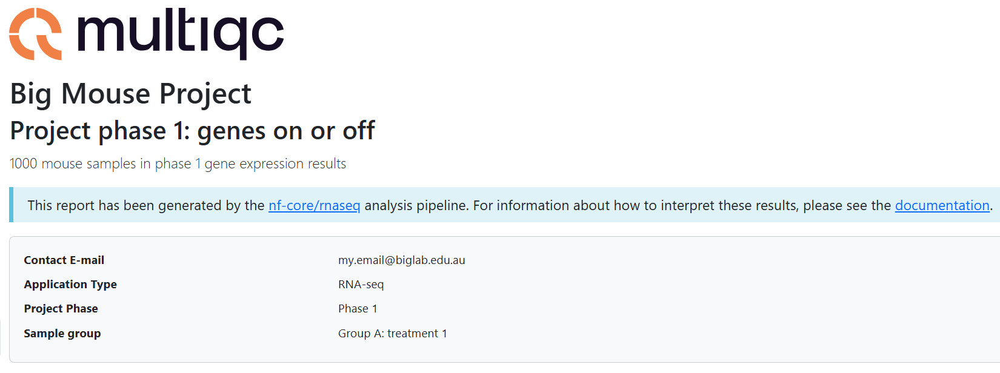

#  2.3 Case study: customisation in action

!!! tip "Objectives"

    - Execute a non-default analysis with an nf-core pipeline
    - Troubleshoot pipeline execution failure
    - Use custom configuration files to resolve the failure
    - Add additional custom configuration files to augment run output 


## 2.3.1 Case study introduction

This section will take a more playful approach to customisation. No new nf-core or Nextflow concepts will be introduced. Instead, we will apply a number of the customisation strategies we have learnt over the last two days to a theoretical real-world customisation scenario. 

We will cover a typical journey experienced when you choose to perform a non-standard analysis, included debugging the dreaded *error message*, searching for the *issue solution*, and working out how to *make the solution work for you*.

We will apply strategic thinking and methodology to:

- Identify what customisations we can make to the rnaseq run to best suit our experiment goals using **pipeline parameters**
- Apply the parameters to the run and **investigate an error message**, including searching known **nf-core issues**
- Use multiple **custom configuration files** to resolve the issue
- **Customise pipeline report files** to validate the non-default workflow choice supports the experiment goals 

<br>


🐭 **The scenario**

Our busy lab is in the throes of a research project that prioritises quick answers about which genes are expressed in the study animals. Transcript-level expression is not of interest - simply 'gene ON' or 'gene OFF' answers, ideally yesterday!  

The project lead is concerned about the time it will take to run the rnaseq workflow over all 1,000 study animals. We can't use HPC as the data is highly protected, so we have been tasked with finding a faster pipeline to identify expressed genes in the samples using our small internal server.  

## 2.3.2 Devising and running a non-default analysis 

Knowing that the main pipeline bottleneck is the STAR_ALIGN process, we decide to review what other aligner choices the workflow provides. 

After visiting the [nf-core/rnaseq user guide](https://nf-co.re/rnaseq/3.23.0) we can see from the metro map that Hisat2 and Bowtie2 can be used instead of STAR:


Bowtie2 uses Salmon quantification like the default STAR-Salmon pipeline we have been running, but Hisat2 does not have this option. However, we spot the tool featureCounts listed under pipeline stage 5, 'Quality control & reporting'. Having used featureCounts before, we know that it performs a fast count of reads mapped to genes. It doesn't provide transcript-level counts like Salmon, but that is not needed for this part of the project. 


!!! example "Exercise 2.3.2 :stopwatch: 3 mins" 

    - Using the [nf-core/rnaseq parameters guide](https://nf-co.re/rnaseq/3.23.0/parameters), find the parameter needed to use the Hisat2 aligner
    - Add the new parameter to `run_rnaseq.sh`
    - Update the `--outdir` value to lesson-2.3
    - Save the script, and resubmit with the command `bash run_rnaseq.sh`

    ??? success "Solution"

        ```bash
        --aligner hisat2 
        ```


!!! abstract "Poll 2.3.2"

    Did your run complete, or fail? 

    If it failed, what was the error printed to the terminal window? 

    ??? success "Solution"

        In this exercise, some runs may succeed, and some may fail! 

        If the run fails, the expected error message is:

        ```console title="Error message"
        Command error: 
         (ERR): mkfifo(/tmp/45.unp) failed. 
         Exiting now ...
         [main_samview] fail to read the header from "-".
        ```


## 2.3.3 Troubleshooting a pipeline error 

The error doesn't give much to go by, apart from that it is something to do with `/tmp` and the piped samtools command received no input. 

A quick `ls -l` shows that we can read and write the VM `/tmp` directory, so we decide to check the command that was executed by the failing process, HISAT2_ALIGN. 

In [Lesson 2.1.2](2.1_params.md/#212-find-and-view-a-process-task-command) we learnt that the command executed by a process was saved within the `.command.sh` file in the process work directory. We learnt how to find the work directory using the `nextflow log` command. 

In this case, we don't need to hunt for the directory as it has been helpfully printed out along with the error message:

*Note: the work directory below is an example of terminal output, your work directory path will be different*

```console title="Example"
Work dir:
  /home/tdev02/session2/work/dc/5184fdc7c63198d41a03c73790b7f6
```

!!! example "Exercise 2.3.3.1 :stopwatch: 2 mins"

    View the `.command.sh` file within the failed process work directory.

    Do you detect any obvious issues with the command?


    ??? success "Solution"

        The command has received our sample reads and input genome files OK. No clues here!

        ```console title=".command.sh"
        INDEX=`find -L ./ -name "*.1.ht2*" | sed 's/\.1.ht2.*$//'`
        hisat2 \
            -x $INDEX \
            -U SRR3473988_trimmed_trimmed.fq.gz \
            \
            --known-splicesite-infile mm10_chr18.filtered.splice_sites.txt \
            --summary-file SRR3473988.hisat2.summary.log \
            --threads 2 \
            --rg-id SRR3473988 --rg SM:SRR3473988 \
            --un-gz SRR3473988.unmapped.fastq.gz \
            --met-stderr --new-summary --dta \
            | samtools view -bS -F 4 -F 256 - > SRR3473988.bam
        ```

<br>

🌐 The logical next step is to check if this is a known error with Hisat2, or with the nf-core Hisat2 module. 


!!! example "Exercise 2.3.3.2 :stopwatch: 3 mins"
    - In a web browser, navigate to the [nf-core/rnaseq github repository](https://github.com/nf-core/rnaseq)
    - Select the 'Issues' tab, and search for issues matching the term 'hisat2'
    - Also search for issues relating to tmp/temp directory errors in the [Hisat2 github repository](https://github.com/DaehwanKimLab/hisat2)

    {width=65%}

    Can you find any issues relating to the `(ERR): mkfifo(/tmp/45.unp)` error in either of these repositories? 

    
    ??? success "Solution"

        The nf-core/rnaseq issues search was not revealing, however a Hisat2 issue titled [Enabling a --temp-directory parameter #438](https://github.com/DaehwanKimLab/hisat2/issues/438) describes the exact error message some of use have encountered. 

        Reading through the issue activity, you can see that the issue has been linked by an nf-core issue titled 
        [update module: HISAT2/ALIGN #9487](https://github.com/nf-core/modules/issues/9487). 

        Following this link, we can see that nf-core have marked this issue as 'WIP' (work in progress). Seems like we have found a solution to our bug! 


!!! tip "The importance of open-source and community contribution"

    By reporting issues and bugs we find in open-source code through github issues, we can effect real change. Developers are typically welcoming of bug reports that help improve their code and happy to help you to use their tool for your research. Other users of a tool may also chime in with their solutions, or you may want to add your helpful tips to an open issue! 


## 2.3.4 Configuring the solution

Lucky for us, we don't need to puzzle out the solution, as it has already been described on the issue ticket. Excellent, since the project lead is insisting we simply cannot wait for nf-core to complete their testing and merge the WIP into the rnaseq pipeline!

The ticket describes a [new release of Hisat2 v 2.2.2](https://github.com/DaehwanKimLab/hisat2/releases/tag/v2.2.2) that includes a new parameter to prevent the `/tmp` error. 

To use Hisat2 for a speedier analysis, we need to make **two custom configurations** to the nf-core/rnaseq pipeline:

1. Use the latest version of Hisat2
2. Apply the new parameter to the Hisat2 process command 


### 2.3.4.1 Applying a custom tool version

Recall from [Lesson 2.1.6.2](2.1_params.md/#2162-software-versions) that all tool versions are included within the MultiQC report as well as a yaml file in the `pipeline_info` folder.  

!!! example "Exercise 2.3.4.1.1 :stopwatch: 3 mins"

    Discover the version of Hisat2 used in our most recent run of nf-core/rnaseq.

    ??? success "Solution"

        Our run used Hisat2 version 2.2.1


We need Hisat2 version 2.2.2 for the new `--temp-dir` parameter. How should we apply this customisation to our our run?


!!! abstract "Poll 2.3.4.1"

    For maintaining **portability and reproducibility**, what is the optimal method to apply our custom Hisat2 container to our pipeline run? 

    a) Within the `nectar_vm.config` institutional config file. It's already working well on our platform, so we can build on it for further customisations without issue. 

    b) Within a separate custom config file named `custom-hisat2-version.config`. We would then apply it at `-c` along with our institutional config whenever it was required. 

    c) Within the Hisat2 module `main.nf` file. This way, we don't need to worry about adding another custom config when we execute the `run` command. 

    ??? success "Answer"

        b) Within a separate custom config file named `custom-hisat2.config`. 
        
        By placing it within a clearly named custom config file, there is less chance of unwittingly executing a workflow that does not match the expected utilisation of tools. Making it a separate config also means it can be easily dropped from our run when nf-core finalises their testing of the issue marked as 'WIP' and includes the resolution within the next version of rnaseq. 
        
        Note that whenever we run an nf-core pipeline, the custom configs we applied are listed under **Core Nextflow options** in the run log, so there is a record that the particular configuration file was applied. 
        Take care to **save** any custom configuration files applied to a run along with the project outputs, and to **use an informative config name**.
        
        In the event that we are testing a different tool version, this should **not** be placed within the institutional config that is shareable with others using nf-core pipelines on the same infrastructure. Doing so would prevent our institutional config from being portable to other analyses, so a) is incorrect. 

        In general, editing the process `main.nf` file is **not** recommended, as this impedes reproducibility. Swapping out tool versions is a bespoke adaptation of the nf-core workflow that would harm reproducibility if it was inadvertently executed, which is likely to happen if it is hidden within the source code, making c) incorrect.  

<br>

To make the purpose of the config clear to anyone else in the lab who runs the pipeline, we will also include a descriptive comment explaining why the config is needed.

!!! note "Comments in Nextflow"

    Commenting code is good practice to make the purpose and logic of the code easier for others and your future self to understand. 
    
    Comments in Nextflow use `//` for single line comments or  `/* .. */` to comment a block on multiple lines.


!!! example "Exercise 2.3.4.1.2 :stopwatch: 5 mins"

    - Create a new file called `custom-hisat2.config`
    - Add a Nextflow comment describing what the config does and why, including the links for the pertinent [Hisat2](https://github.com/DaehwanKimLab/hisat2/issues/438) and [nf-core](https://github.com/nf-core/modules/issues/9487) issues
    - Identify the fully qualified process name/process execution path for the `HISAT2_ALIGN` process
    - Within a `process` scope code block, provide the process name identified above to the appropriate process selector
    - Within the process selector code block, add the path to the Hisat2 v 2.2.2 container described in the [nf-core issue](https://github.com/nf-core/modules/issues/9487):

    ```groovy
    container = 'https://community-cr-prod.seqera.io/docker/registry/v2/blobs/sha256/c3/c36472269e8898f63b7b65dd40433462d541f9e75f9401f0bf8488021275d006/data'
    ```

    ??? hint "Hint: Process execution paths"

        You can obtain the process execution path from the execution trace, timeline or report files within `<outdir>/pipeline_info`. 

        Process names are not always unique in nf-core pipelines that may contain modules from other sources. Best practice for specificity is to use the fully qualified process name, which typically takes the form:

        `PIPELINE_NAME:WORKFLOW_NAME:SUBWORKFLOW_NAME:PROCESS_NAME`  

    ??? hint "Hint: Process selectors"

        We learnt about process selectors in [Lesson 2.2.5](2.2_config.md/#225-custom-resource-configuration-using-process-labels) and [Lesson 2.2.6](2.2_config.md/#226-custom-resource-configuration-using-process-names)

    ??? hint "Hint: Syntax help"

        Our `nectar_vm.config` files contain `process` scope and process selector code blocks. Our hisat2 config will be more simple, not requiring the `profile` or `singularity` scopes we have within our Nectar institutional config. 

    ??? success "Solution"

        ```groovy
        // Custom config to apply latest Hisat2 v 2.2.2 to nf-core/rnaseq v 3.23.0
        // Required to add new Hisat2 --temp-directory parameter to resolve known issue
        // Hisat2 issue: https://github.com/DaehwanKimLab/hisat2/issues/438
        // nf-core issue: https://github.com/nf-core/modules/issues/9487
        //
        // This config should be dropped when running future nf-core/rnaseq versions that resolve the issue

        process {
            withName: "NFCORE_RNASEQ:RNASEQ:FASTQ_ALIGN_HISAT2:HISAT2_ALIGN" {
                container = 'https://community-cr-prod.seqera.io/docker/registry/v2/blobs/sha256/c3/c36472269e8898f63b7b65dd40433462d541f9e75f9401f0bf8488021275d006/data'
            }
        }
        ```


<br>

!!! important "Caveat"

    Note that for deploying nf-core workflows, it is not recommended to change the tool versions within the workflow, as this will decrease portability and reproducibilty! This exercise is to demonstrate how you can specify containers, as this may aid you in developing and testing your own Nextflow workflows or testing new tool versions. When a non-standard version of a tool is used for publishing nf-core pipeline results, this should be clearly stated within the methods section of the publication.  


### 2.3.4.2 Adding a custom tool parameter

As we learnt in [Lesson 1.3.6](../session_1/1.3_configure.md/#configuring-processes), nf-core modules define an `ext.args` process directive that can be used to add any tool parameter to a process command. 

The utility of this directive is wide-reaching when you consider the number of optional parameters a typical bioinformatics tool may have. It is not feasible for nf-core to paramaterise all of these arguments...

{width=40%}

Extra convenience has been added for some commonly-used tools by wrapping the `ext.args` directive within a pipeline parameter, typically named `--extra_<tool>_args`. 

!!! example "Exercise 2.3.4.2.1 :stopwatch: 2 mins"

    - Open the [nf-core/rnaseq parameters online guide](https://nf-co.re/rnaseq/3.23.0/parameters) and check for any `--extra_<tool>_args` parameters
    - Can you find a pipeline parameter to add extra arguments to the Hisat2 tool?


    ??? success "Solution"

        There is no such parameter for Hisat2. 
        
        Included in version 3.23.0 of nf-core/rnaseq are:

        - `--extra_trimgalore_args`
        - `--extra_fastp_args`
        - `--extra_star_align_args`
        - `--extra_bowtie2_align_args`
        - `--extra_salmon_quant_args`
        - `--extra_kallisto_quant_args`
        - `--extra_fqlint_args`
        

!!! tip "Using `ext.args` in the absence of `--extra_<tool>_args`"
    The `ext.args` directive typically forms part of all nf-core module code. If you wish to customise a tool that does *not* have an `--extra_<tool>_args` pipeline parameter, you can still add custom parameters with a **custom configuration file** that passes your parameter to the target module via `ext.args`.  
    

Let's see this tip in action!


!!! example "Exercise 2.3.4.2.2 :stopwatch: 3 mins"

    - Using the procedure described in [Exercise 2.2.2.3](2.2_config.md/#222-default-nf-core-configuration), view the `main.nf` file for the HISAT2_ALIGN process:

    ```bash
    find ./rnaseq -type d  -name "*hisat2*" -print
    ```

    ```console title="Output"
    ./rnaseq/modules/nf-core/hisat2
    ./rnaseq/subworkflows/nf-core/fastq_align_hisat2
    ```


    The nf-core subworkflow named FASTQ_ALIGN_HISAT2 shows the module path for HISAT2_ALIGN as `modules/nf-core/hisat2/align/main.nf`. 
    
    Viewing this `main.nf` file, we can see a line of Nextflow code that defines a variable called `args` and assigns it the contents of `ext.args`. If `ext.args` is empty, the `args` variable remains empty: 

    ```groovy title="lines 26-27 of rnaseq/modules/nf-core/hisat2/align/main.nf"
    26      script:
    27      def args = task.ext.args ?: ''
    ```

    Further down, within the hisat2 command that is executed by the process, we can see the `$args` variable added to the hisat2 command:

    ```bash title="lines 42-52 of rnaseq/modules/nf-core/hisat2/align/main.nf"
    42          hisat2 \\
    43              -x \$INDEX \\
    44              -U $reads \\
    45              $strandedness \\
    46              $ss \\
    47              --summary-file ${prefix}.hisat2.summary.log \\
    48              --threads $task.cpus \\
    49              $rg \\
    50              $unaligned \\
    51              $args \\
    52              | samtools view -bS -F 4 -F 256 - > ${prefix}.bam
    ``` 


Now that we have verified that we can provide the extra parameter needed, we can add it to our **custom configuration file**.

Our next run will include two custom configs. This is valid, and we can add as many configs as needed to customise our run. Some configurations should be grouped within a single config file, for example customising compute resources within an institutional config. Others are best placed within distinct and explicitly named configs to ensure they are only applied when needed. We can also leverage `profiles` to group configuratons that apply to a certain environment or analysis, and we will build upon that in an upcoming exercise. 


!!! note "Specifying multiple configs"

    When adding multiple custom configs, we can supply them to `-c` in a **comma-delimited list**, for example `-c custom-1.config,custom-2.config`.

    Alternatively, we can include `-c` several times, for example `-c custom-1.config -c custom-2.config`. 


!!! example "Exercise 2.3.4.2.3 :stopwatch: 2 mins"

    - Provide `--temp-directory .` to the `ext.args` directive within the process selector code block of `custom-hisat2-version.config`
    - Update `run_rnaseq.sh` by adding `custom-hisat2.config` to the Nextflow `-c` parameter, and ensure the Nextflow `-resume` flag is applied
    - Change `--outdir` to `lesson-2.3.4`
    - Save both scripts, then resubmit your run with `bash run_rnaseq.sh`
    
    💡 When running tools with containers, the process is running *inside* the container, so the `./` path will evaluate to a location inside the container. This will ensure that the `tmp` directory used by each process will be *unique*, and avoid error-inducing clashes when multiple HISAT2_ALIGN processes attempt to write to the user's `/tmp` on the local machine. 

    ??? success "Solution"

        ```groovy
        // Custom config to apply latest Hisat2 v 2.2.2 to nf-core/rnaseq v 3.23.0
        // Required to add new Hisat2 --temp-directory parameter to resolve known issue
        // Hisat2 issue: https://github.com/DaehwanKimLab/hisat2/issues/438
        // nf-core issue: https://github.com/nf-core/modules/issues/9487
        //
        // This config should be dropped when running future nf-core/rnaseq versions that resolve the issue

        process {
            withName: "NFCORE_RNASEQ:RNASEQ:FASTQ_ALIGN_HISAT2:HISAT2_ALIGN" {
                container = 'https://community-cr-prod.seqera.io/docker/registry/v2/blobs/sha256/c3/c36472269e8898f63b7b65dd40433462d541f9e75f9401f0bf8488021275d006/data'
                ext.args = '--temp-directory .'
            }
        }
        ```

Hopefully your run now completes without error. Given that the error is *intermittent* we would like to verify at the code level that the fix has been applied to our test mice samples before we run it on the other 998! 


!!! example "Exercise 2.3.4.2.4 :stopwatch: 5 mins"

    - Check that the custom version 2.2.2 of hisat2 was run
    - Check that the custom parameter `--temp-directory .` was applied to the HISAT2_ALIGN process command

    ??? hint "Hint: Tool versions"

        Recall from [Lesson 2.1.6.2](2.1_params.md/#2162-software-versions) that all tool versions are included within the MultiQC report as well as a yaml file in the `pipeline_info` folder. 

    ??? hint "Hint: Process `.command.sh` file"

        Finding the `.command.sh` for a process within the process work directory using `nextflow log` was practised in [Exercise 2.1.3](2.1_params.md/#213-checking-execution-at-the-process-level).

    ??? success "Solution"

        - Check that the custom version 2.2.2 of hisat2 was run:

        ```bash
        grep -i hisat lesson-2.3.4/pipeline_info/nf_core_rnaseq_software_mqc_versions.yml
        ```

        ```console title="Output"
        HISAT2_ALIGN:
        hisat2: 2.2.2
        HISAT2_BUILD:
        hisat2: 2.2.1
        HISAT2_EXTRACTSPLICESITES:
        hisat2: 2.2.1
        ```

        A quick check shows us that ***yes*** HISAT2_ALIGN has used our custom version... ***but*** not the other Hisat modules - oops! 🗒️ We make a note to update our hisat2 config file to ensure all Hisat2 modules use the new version, as **version consistency** within data analysis is crucial for reproducibility and preventing version conflicts.  

        - Check that the custom parameter `--temp-directory .` was applied to the HISAT2_ALIGN process command:

        ```bash
        nextflow log  <run_name> -f workdir,name | grep HISAT2_ALIGN
        cat <workdir>/.command.sh
        ```

        ```console title="Output"
        hisat2 \
            -x $INDEX \
            -U SRR3473989_trimmed_trimmed.fq.gz \
            \
            --known-splicesite-infile mm10_chr18.filtered.splice_sites.txt \
            --summary-file SRR3473989.hisat2.summary.log \
            --threads 2 \
            --rg-id SRR3473989 --rg SM:SRR3473989 \
            --un-gz SRR3473989.unmapped.fastq.gz \
            --temp-directory . \
            | samtools view -bS -F 4 -F 256 - > SRR3473989.bam
        ```

        👍 HISAT2_ALIGN is using the custom version and custom parameter to resolve our issue. 


## 2.3.5 Customising resource tracing

After running a few test mice through our customised workflow, we are impressed by the speed gains we have achieved, with most samples completing in less than half the time!

We want to create some figures showing speedup of the customised workflow to present at the next project meeting, but the default nf-core `pipeline_info` [trace file](https://docs.seqera.io/nextflow/reports#trace-file) does not contain all the fields we need. Fortunately, trace files can be customised to include any combination of [available fields](https://docs.seqera.io/nextflow/reference/config#tracefields).

The `rnaseq/nextflow.config` file enables the `trace` option and sets a unqiue filename using date and timestamp:

```groovy
trace {
    enabled = true
    file    = "${params.outdir}/pipeline_info/execution_trace_${params.trace_report_suffix}.txt"
}
```

Note that the `trace.fields` option is absent, meaning nf-core is using the default fields for Nextflow `trace`. To discover the default fields when `trace` is enabled, view the fields included in the example [trace file](https://docs.seqera.io/nextflow/reports#trace-file), or the `pipeline_info/execution_trace_<date>_<time>.txt` from one of your completed runs from this session. 

There is no option to `trace` that allows *adding* fields to the default, but we can *over-ride* the default fields with our custom fields using the `trace.fields` option within a custom configuration file. 


!!! tip "Nextflow log fields vs trace fields"

    Recall the `nextflow log -l` command introduced in [Lesson 1.2.5](../session_1/1.2_run.md/#125-nextflow-log).

    The fields printed by `nextflow log -l` and their meanings are identical to the fields available to `trace.fields` with an **important exception**. Since the `%` symbol is a special character, `%cpu` and `%mem` as described for Nextflow `trace` correspond to `pcpu` and `pmem` for the `nextflow log -f` command-line utility.  


!!! example "Exercise 2.3.5.1 :stopwatch: 5 mins"
    
    We would like to plot the walltime, CPU requested, % CPU used, memory requested, and % memory used so we can compare resource and time savings between the default STAR-Salmon run and our customised Hisat2 run. 

    - View the [available trace fields](https://docs.seqera.io/nextflow/reference/config#tracefields) and identify which fields we need to produce these plots
    - Check which fields are included in the default trace file and identify any from our list that are not included
    - Create a new custom configuration file called `custom-trace.config`, add a descriptive comment, and add a `trace` scope code block
    - Within the `trace` scope, provide a comma-separated list of fields to include to the `fields` option of trace
        - You can choose whether to list all default fields and add our custom fields, or a shorter list including the fields we want to plot
        - If you choose a shorter list of fields, include the `name` field to identify which processes the resource details apply to
        - Your list should be enclosed in quotes, eg `fields = 'field1,field2'`
    
    ??? succes "Solution"

        The fields we need for our resource plots are:

            - `cpus`
            - `%cpu`
            - `memory`
            - `%mem`
            - `realtime`

        Of these, the following are included in the nf-core/rnaseq trace file by default:

            - `%cpu`
            - `realtime`

        The custom fields we need to add are:

            - `cpus`
            - `memory`
            - `%mem`

        **`custom-trace.config` with all default plus custom fields:**

        ```groovy
        // Custom config to add CPUs requested, memory requested, and % memory used to default nf-core trace

        trace {
            fields = 'task_id,hash,native_id,name,status,exit,submit,duration,realtime,%cpu,peak_rss,peak_vmem,rchar,wchar,cpus,memory,%mem'
        }
        ```

        **`custom-trace.config` with minimum fields for resource plots:**

        ```groovy
        // Custom config for minimal time, cpu and memory tracing
        
        trace {
            fields = 'name,realtime,cpus,%cpu,memory,%mem'
        }
        ```

The next step is to add the new config to our run. The `-c` config list is growing rather long:

```bash
-c workshop.config,custom-hisat2-version.config,custom-trace.config
```

Each config is a discrete set of customisations matching a specific purpose - they are **modular** and **portable** - yet they are all required to run this analysis on this data on this VM. It makes sense then to logically group these configs under our `workshop` profile. 

!!! example "Exercise 2.3.5.2 :stopwatch: 8 mins"

    - Open `workshop.config`
    - Under the `workshop` profile, add `custom-hisat2-version.config` and `custom-trace.config` to the `includeConfig` option
    - Update `run_rnaseq.sh` by removing `custom-hisat2.config` from the Nextflow `-c` parameter
    - Change `--outdir` to `lesson-2.3.5`
    - Save both scripts, then resubmit your run with `bash run_rnaseq.sh`

    - Observe the launch log as your run starts, noting that we now have *three* custom configs printed under 'Core Nextflow options' 

profiles {
    workshop {
        includeConfig 'nectar_vm.config'
    }
}


!!! example "Exercise 2.3.5.3 :stopwatch: 1 min"

    - Open the file `lesson-2.3.5/pipeline_info/execution_trace_<date>_<time>/txt` by double clicking it in the VS Code explorer pane
    - Check that the custom fields you have specified have been applied

    !!! tip "Tracing cached processes"
    
        For processes with status `CACHED`, the resources reported in the trace file (as well as other `pipeline_info` files) are from the actual compute required to execute the process, and not the time this execution took to restore the data from cache. 

- add to profile


### 2.3.6 Personalise MultiQC reports

To polish up our presentation for the Big Project Meeting, we want to add some custom detail to the MultiQC report. Recall that this was the report that revealed the strandedness error we debugged in [Lesson 2.1.4](2.1_params/#214-resolve-a-pipeline-warning-with-a-parameter). 

Many nf-core pipelines use [MultiQC](https://multiqc.info/docs/) to aggregate results and statistics output by various bioinformatics tools, helping to summarise experiments containing multiple samples and multiple analysis steps. MultiQC reports can be [customised](https://docs.seqera.io/multiqc/reports/customisation), and nf-core has enabled this functionality with the [`--multiqc_config` parameter](https://nf-co.re/rnaseq/3.23.0/parameters#multiqc_config).

!!! important "Hidden nf-core parameters"

    The `--multiqc_config` parameter is a **hidden parameter!** To see this parameter, you need to apply `--showHidden` on the command line help, or select **'Show hidden'** on the lower right hand side of the nf-core parameters webpage. 

We will create a custom MultiQC config to:


- Add a custom report header
- Overlay a [theoretical GC content track](https://multiqc.info/modules/fastqc/#theoretical-gc-content) specific for our mouse reference genome


!!! example "Exercise 2.3.6.1 :stopwatch: 1 mins"

    - Create a new file named `custom-multiqc.yaml`
    - At the `report_header_info` config option, add a [custom report header](https://docs.seqera.io/multiqc/reports/customisation#project-level-information)
        - You can add any details you choose under `report_header_info`, as long as they conform to the yaml key:value pairs format 
    - At the `fastqc_config` option, specify [`fastqc_theoretical_gc`](https://docs.seqera.io/multiqc/modules/fastqc/#theoretical-gc-content) as the yaml key and `mm10_txome` (mouse transcriptome) as the yaml value
    - Add some [titles and introductory text](https://docs.seqera.io/multiqc/reports/customisation#titles-and-introductory-text) if desired
    - Save the file
    

    ??? success "Solution"

    **Example `custom-multiqc-config.yaml`:**

    ```yaml
    title: "Top Secret Mouse Gene Experiment"
    subtitle: "Project phase 1: genes on or off"
    intro_text: "1000 mouse samples in phase 1 gene expression results"
    report_header_info:
        - Contact E-mail: "my.email@biglab.edu.au"
        - Application Type: "RNA-seq"
        - Project Phase: "Phase 1"
        - Sample group: "Group A: treated"
    fastqc_config:
        fastqc_theoretical_gc: "mm10_txome"
    ```


Next step is to provide our MultiQC configurations to our run command. You may be expecting to add this configuration file at the Nextflow `-c` parameter in your run command. In this case, we *do not* add the configuration at `-c`, since nf-core/rnaseq includes the[`--multiqc_config` parameter](https://nf-co.re/rnaseq/3.23.0/parameters#multiqc_config). Further, this is a yaml file matching the input format expected by the tool MultiQC, and not a Nextflow configuration file. 

!!! example "Exercise 2.3.6.2 :stopwatch: 3 mins"

    - Add the MultiQC yaml file to your run command in `run_rnaseq.sh`
    - Save both scripts and submit your run 

    ??? success "Solution" 


&#x27A4; View the html file `Lesson-2.4.2/multiqc/star_salmon/multiqc_report.html`


Notice your custom report header info at the top of the page:



Navigate to the section titled **FastQC: Per Sequence GC Content**. Compare the two plots to observe the custom track has been successfully added. 


:eyes: This track has shown that our sample transcriptomes follow a normal distribution consistent with the mm10 reference. 


!!! note "Key points"

    - You can customise resource tracing, mutliqc report format and container use through custom configuration files
    - `ext` is a very handy Nextflow directive that has been enabled by nf-core to provide full tool functionality for end users through `ext.args` in custom configs
    - You can specify multiple custom configuration files at the Nextflow option `-c` in a comma-delimited list 
    - Appropriate custom config use provides **modularity, portability and reproducibility** to nf-core workflows 
    - **There is no substitute for reading the tool docs when customising your runs!** :book:


~~~~~~~~~~
live server issue 

kill vs code server on the host

relog in 