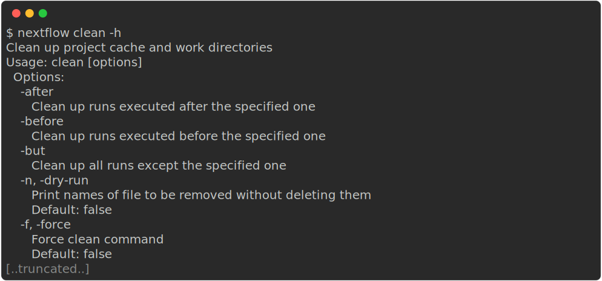

# Tips and tricks

## Installing Nextflow

Nextflow is distributed as a self-installing package and can be installed using a few easy steps:

1. Download the executable package using either `wget -qO- https://get.nextflow.io | bash` or `curl -s https://get.nextflow.io | bash`
2. Make the binary executable on your system by running `chmod +x nextflow`.
3. Move the `nextflow` file to a directory accessible by your `$PATH` variable, e.g. `~/.local/bin/`

## Installing nf-core tools

nf-core tools is written in Python and is available from the [Python Package Index (PyPI)](https://pypi.org/project/nf-core/):

```default
pip install nf-core
```

Alternatively, nf-core tools can be installed from [Bioconda](https://anaconda.org/bioconda/nf-core):

```default
conda install -c bioconda nf-core
```

## Cleaning up the work directory

Your work directory can get very big very quickly (especially if you are using full sized datasets). It is good practise to `clean` your work directory regularly. Rather than removing the `work` folder with all of it's contents, the Nextflow `clean` function allows you to selectively remove data associated with specific runs.

```default
nextflow clean -help
```



Note that to prevent unintended deletion of important data, `nextflow clean` **requires** you to supply either the `-dry-run` or `-force` flag. By running `nextflow clean -dry-run`, you will see a list of files that would be removed if you were to instead provide the `-force` flag.

Additionally, the `-after`, `-before`, and `-but` options are all very useful to select specific runs to clean.


## Listing and dropping cached workflows

When using `nextflow pull` and `nextflow run` to automatically pull workflows from their GitHub repositories, they will be cached locally within your `$HOME/.nextflow/assets` directory. Over time, these will build up and you might want to clean this directory up. Nextflow has functionality to help you to view and remove these cached workflows.

The `nextflow list` command prints the projects stored in your cache folder. If you want to remove a specific workflow from your cache you can remove it using the Nextflow `drop` command:

```default
nextflow drop <workflow>
```
